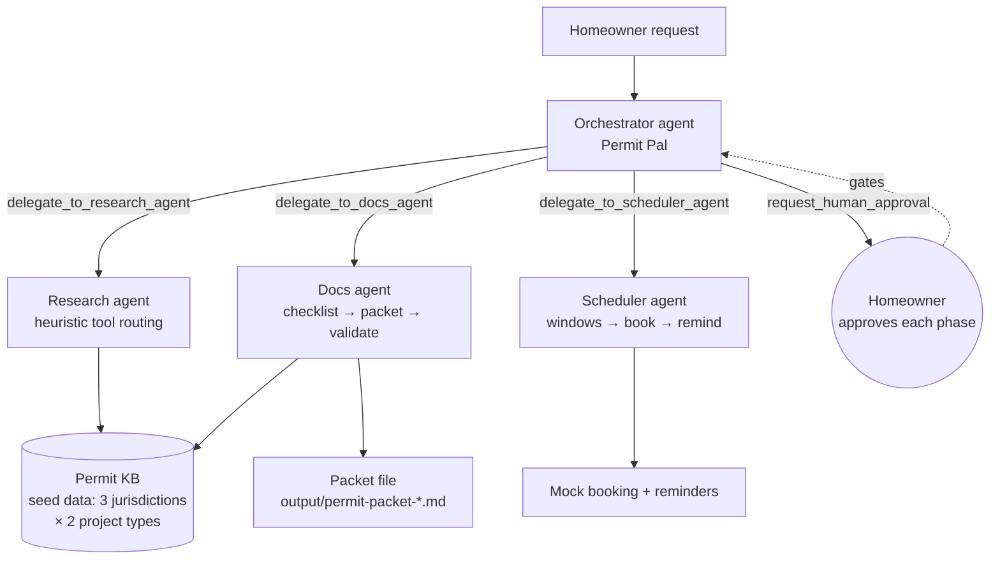

# Permit Pal 🏠

**A background multi-agent system that shepherds a homeowner through a home-improvement permit application end-to-end — with a human approving every critical step.**

Built for the **Agents for Humans Hackathon (AWS)** — Everyday track. Pure [Strands Agents SDK](https://github.com/strands-agents/sdk-python), multi-agent orchestrator pattern, human-in-the-loop governance, and a deterministic eval harness.

## The problem

Getting a building permit is a maze: every city has different requirements, documents, fees, and inspections, buried in PDFs and portal FAQs. Homeowners either overpay expediters or submit incomplete packets and wait weeks for corrections. Permit Pal turns it into a guided, auditable workflow: research → assemble → schedule → submit, with the homeowner approving each phase.

## Why it wins

- **Technical Implementation:** Real Strands multi-agent system — an orchestrator agent delegating to three specialist sub-agents (agents-as-tools), each with a narrowly scoped toolset; plus a custom `Model` provider implementation and a 29-case eval harness. Clean swap to `BedrockModel`/AgentCore documented below.
- **Design:** A complete product loop, not a POC: the demo produces a real application-packet file, a booked inspection (mock), deadline reminders, and a 3/3 approval audit trail.
- **Potential Impact:** ~Every US homeowner doing renovations hits this; expediters charge $500–$2,000 per permit. A trustworthy shepherd compresses weeks of confusion into one guided session.
- **Creativity & Originality:** Permits are an unsexy, high-friction domain agents are genuinely good at — requirement extraction, checklist assembly, deadline tracking — paired with governance (approvals as first-class tools) instead of a chatbot that just talks about permits.
- **Presentation:** One-command end-to-end demo (`.venv/bin/python demo.py`); see `DEMO_SCRIPT.md` for the ≤5-minute video shot list.

## Architecture



### Agent design

| Agent | Role | Tools (scoped, no overlap) |
|---|---|---|
| Orchestrator | Phase discipline: delegate, then gate on approval | `delegate_to_research_agent`, `delegate_to_docs_agent`, `delegate_to_scheduler_agent`, `request_human_approval` |
| Research | Permit-requirement lookup | `lookup_permit_requirements`, `list_jurisdictions`, `get_project_types` |
| Docs | Packet assembly pipeline | `assemble_checklist`, `generate_application_packet`, `validate_packet` |
| Scheduler | Inspection scheduling pipeline | `get_inspection_windows`, `book_inspection`, `add_deadline_reminder` |

The orchestrator never touches the KB, a packet, or a booking directly — it only delegates and enforces approvals. Specialists own narrow toolsets (disciplined tool design, no "LLM calls in a trench coat").

### The model question (read this — it's the honest part)

The demo runs on **`HeuristicModel`** (`permit_pal/models.py`), a deterministic `strands.models.Model` implementation: the orchestrator follows a fixed 6-step pipeline and the research agent routes tools by keyword heuristics. **No LLM is called, no AWS credentials are needed, and the demo is fully reproducible.**

The eval harness (`evals/run_evals.py`) is model-agnostic: it measures tool-selection accuracy, KB completeness, and approval gating. Run it against a real model with:

```python
from permit_pal.agents import build_orchestrator
from permit_pal.models import build_bedrock_model
agent = build_orchestrator()  # or Agent(model=build_bedrock_model(), ...)
```

`build_bedrock_model()` returns a `BedrockModel` — set your model ID and AWS credentials and the same agents, tools, and evals run live (and can deploy on AgentCore). The demo video and this README never claim live Bedrock/AgentCore usage.

## Eval results

`PERMIT_PAL_DEMO=1 .venv/bin/python evals/run_evals.py` — **29/29 pass** (2026-09-14, deterministic heuristic model):

| Suite | Result | What it proves |
|---|---|---|
| routing_accuracy (unit) | 15/15 | Research agent picks the right tool across 15 varied phrasings |
| routing_accuracy (integration) | 3/3 | Full `Agent` invocations route to the expected tool (via call trace) |
| requirement_completeness | 6/6 | Every jurisdiction × project type: packet contains all required docs (`validate_packet=PASS`) |
| approval_gating | 5/5 | Exactly 3 approvals; each phase gated; submission approval is the final step |

Example routing cases: "What permits do I need for a deck in Austin, TX?" → `lookup_permit_requirements`; "Which jurisdictions do you cover?" → `list_jurisdictions`; "What project types are supported in Denver?" → `get_project_types`.

## How to run

```bash
python3 -m venv .venv && .venv/bin/pip install -r requirements.txt

# End-to-end demo (approvals auto-granted with a loud banner)
.venv/bin/python demo.py

# Eval harness
.venv/bin/python evals/run_evals.py

# Interactive mode (approvals prompt on stdin)
PERMIT_PAL_DEMO= .venv/bin/python demo.py
```

The demo produces `output/permit-packet-austin-tx-deck-addition.md` and prints the full 13-step tool-call trace with the 3/3 approval audit.

## What's mocked (full honesty)

- **The model**: `HeuristicModel` is deterministic and heuristic — it stands in for an LLM so the demo runs offline. Swap in `build_bedrock_model()` for live inference.
- **The knowledge base**: `permit_pal/data/permits.json` is simplified *sample* data for Austin TX, Seattle WA, Denver CO × deck/kitchen. Verify against official municipal sources before real use.
- **Inspection booking & reminders**: `book_inspection` returns a deterministic mock confirmation (`PP-XXXXXX`); reminders are in-memory.
- **Approvals in demo mode**: auto-approved with an unmissable banner; interactive mode prompts for real.

No secrets, API keys, or credentials anywhere in this repo.

## Roadmap

1. Live Bedrock model + AgentCore deployment (one-line model swap; evals re-run live).
2. Real municipal-code retrieval (city open-data APIs / scraped code libraries) replacing the seed KB.
3. Jurisdiction portal integrations for real submission + inspection booking.
4. Regression evals in CI: every prompt/tool change re-runs the 29-case suite.
5. Homeowner web UI + mobile push approvals (the approval tool already abstracts the channel).

## Layout

```
permit-pal/
├── demo.py                  # one-command end-to-end demo
├── evals/run_evals.py       # 29-case deterministic eval harness
├── permit_pal/
│   ├── agents.py            # orchestrator + 3 specialists (agents-as-tools)
│   ├── models.py            # HeuristicModel (demo) + build_bedrock_model()
│   ├── tools_research.py    # KB lookup tools
│   ├── tools_docs.py        # checklist / packet / validation tools
│   ├── tools_scheduler.py   # inspection windows / booking / reminders
│   ├── tools_approval.py    # human-in-the-loop approval gate
│   ├── kb.py                # KB loading + fuzzy case extraction
│   └── data/permits.json    # sample seed data (3 jurisdictions × 2 projects)
├── DEMO_SCRIPT.md           # ≤5-min video shot list
└── requirements.txt
```
